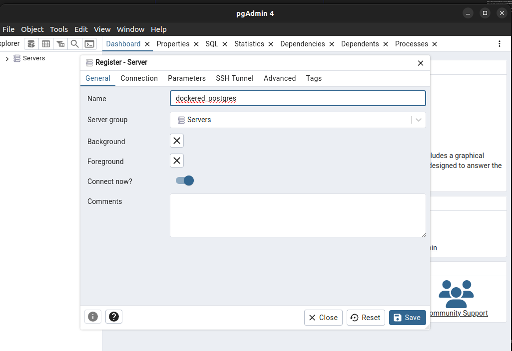
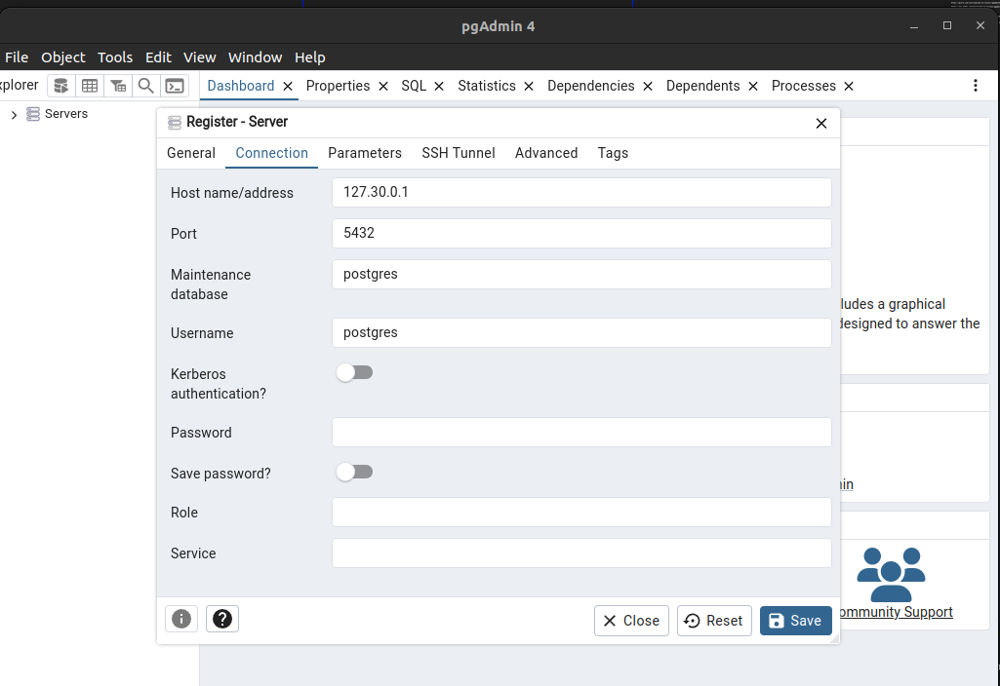

https://gcore.com/learning/how-to-install-pgadmin4-on-ubuntu/

https://www.webhi.com/how-to/how-to-install-pgadmin4-on-ubuntu-18-04-20-04-22-04/


curl https://www.pgadmin.org/static/packages_pgadmin_org.pub | sudo apt-key add


sudo sh -c 'echo "deb https://ftp.postgresql.org/pub/pgadmin/pgadmin4/apt/focal/ pgadmin4 main" > /etc/apt/sources.list.d/pgadmin4.list && apt update'


sudo apt install pgadmin4


configure pgadmin4






Password: postgres


```bash

CREATE DATABASE ideefix
    WITH
    OWNER = postgres
    ENCODING = 'UTF8'
    LOCALE_PROVIDER = 'libc'
    CONNECTION LIMIT = -1
    IS_TEMPLATE = False;

```
